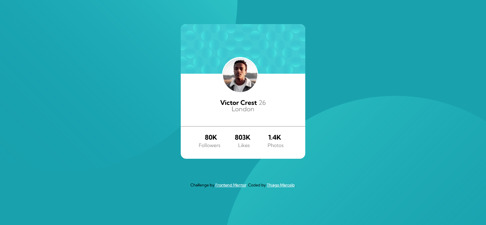
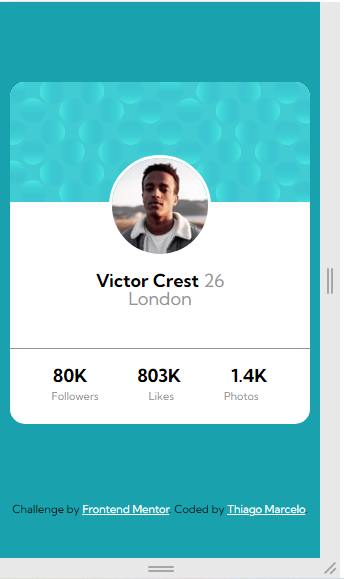

# Frontend Mentor - Profile card component solution

This is a solution to the [Profile card component challenge on Frontend Mentor](https://www.frontendmentor.io/challenges/profile-card-component-cfArpWshJ). Frontend Mentor challenges help you improve your coding skills by building realistic projects. 

## Table of contents

- [Frontend Mentor - Profile card component solution](#frontend-mentor---profile-card-component-solution)
  - [Table of contents](#table-of-contents)
  - [Overview](#overview)
    - [The challenge](#the-challenge)
    - [Screenshot](#screenshot)
    - [Links](#links)
  - [My process](#my-process)
    - [Built with](#built-with)
    - [What I learned](#what-i-learned)
    - [Continued development](#continued-development)
    - [Useful resources](#useful-resources)
  - [Author](#author)


## Overview

### The challenge

- Build out the project to the designs provided

### Screenshot




### Links

- Solution URL: [Front End Mentor](https://www.frontendmentor.io/challenges/profile-card-component-cfArpWshJ/hub/profile-card-component-html5-and-css3-INn-z9eGD)
- Live Site URL: [GitHub Pages](https://marcelx-silva.github.io/profile-card-component/)

## My process

### Built with
- HTML5
- CSS custom properties
- Reset CSS
- Flexbox


### What I learned
During this project I've learned some CSS3 properties to positioning and set background  images and a little bit more about media queries. 

To see how you can add code snippets, see below:

```css
@media(max-width:375px) {
   .card{
        //code
      }
      ...
}
```

```css
 background-image:
    url(./images/bg-pattern-top.svg),
    url(./images/bg-pattern-bottom.svg);
    background-repeat:  no-repeat;
    background-position: -80% 110%, 160% -60% ;
```

### Continued development

After this project I will focus more on pseudo-elements to learn more about it and continue to practice Javascript to implement in future projects. 

### Useful resources

- [Controlling background-images | CSS Tutorial - by Kevin Powell](https://youtu.be/3T_Jy1CqH9k) - This helped me for positioning images in the website and I have learned that it is possible to position two or more background images.
- 
- [Tutorial de media queries do CSS – resoluções padrão, breakpoints em CSS e tamanhos de telefone by Diego Rosa](https://www.freecodecamp.org/portuguese/news/tutorial-de-media-queries-do-css-resolucoes-padrao-breakpoints-do-css-e-tamanhos-de-telefone/) - This is helped me to understant a little bit more about media queries. 


## Author

- Website - [Thiago Marcelo Pereira da Silva](https://www.linkedin.com/in/marcelo-thiago/)
- Frontend Mentor - [@marcelx-silva](https://www.frontendmentor.io/profile/marcelx-silva)

